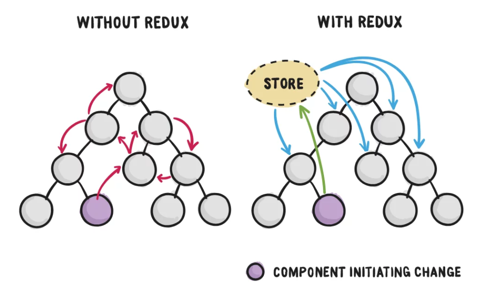

# 使用Redux快速入门上手React全局状态管理(React@16.8之后的Hook版本+Redux@Toolkit)


先说一些废话，相信大家在学习新技术的时候，一定会先从官方文档入手，然后就着一些总结比较好的技术博客，来一起食用🍜学习。
不过，前端技术栈的更新🚀速度不可谓不快，几乎每过一两年都会一些重大的版本更新🚀发布，有些时候学习新技术，会有大量的 ***老版本***  博客📚，
他们写的非常好，但是往往不会注明当时的版本，导致我们在搜索的时候经常看了半天，却发现和官方的新写法有比较大的差异，对于入门的同学十分不友好😵️~
所以，在今天开始我们的技术博客之前，先说明，本教程的目标对象✨：  
1. 刚入门学习`React`想要学习如何快速上手使用Redux的同学✔️  
2. 对于`React@16.8`的Hook版本之后的`React`语法有基本了解的同学✔️  
3. 对于`Redux`各种中间件，各种配置，各种目录规范配置十分头疼的同学（本教程使用基本都是`Redux@Toolkit`现代工具包大幅简化之后的操作）✔️  

好了废话说完了，接下来我们开始我们今天要学习的内容~


### 什么是Redux?
`Redux`是`JavaScript状态容器`，提供可预测化的状态管理。它可以让你构建一致化的应用，运行于不同的环境（客户端、服务器、原生应用），并且易于测试  


### 什么时候使用Redux?
说说我的通俗理解，当我们在一些大型的`React`项目中开发的时候，往往有很多时候会需要用到全局的状态通信或者深度的树结构嵌套，这个时候，
如果我们用单项数据流去通信，会使我们的开发增加了极大的复杂度，这个时候`Redux`就帮我们解决了这个痛点，他可以帮我们在全局管理我们需要通信的状态，
大大简化我们的开发复杂度，他主要有以下几个使用场景：
1. 无共同父组件的兄弟组件之间的通信  
2. 需要全局更新状态的组件，比如一些权限控制  
3. 应对状态树过于复杂的时候，比如组件深度嵌套之后，上层组件和底层组件的通信  
4. 存在状态需要以很多不同的方式去更新  
5. 一些简单的场景也适用，不过没有那么必要，使用路由传参或者组件通信就可以快速解决我们的需求  

下面这张图可以非常直观的展示为什么我们需要`Redux`  



### 什么是Redux@Toolkit？
它是Redux官方推出的一个`Redux工具集`（简称`RTK`)，它可以帮助大家大大简化store的配置，减少`Redux`其他开发依赖包的安装，并减少书写大量的模板代码。
如果你使用的是`Chorme浏览器`，那么，我推荐安装一下`React DevTools`和`Redux DevTools`这两个拓展，它们能帮你很直观的看到数据的流向和操作历史    


### 在开始使用之前让我们来了解一下Redux的一些基本术语和运行规则  
1. `Immutability`不变性  
2. Action行动  
3. ActionCreators行动创造者  
4. Reducers减速器  
5. Store商店  
6. Dispatch选择  
(周末记得写一下链接)

#### Immutability不变性
官方文档中这样描述不变性，默认情况下，`JavaScript`对象或数组都是可变的，这样直接改变对象或数组，意味着引用地址被改变，
在`Redux`中，为了一成不变的更新值，你的代码必须复制现有的对象或数组，然后修改副本  

通俗点说就是，我们不应该在对象和数组做了浅拷贝操作之后处理副本，而是应该深拷贝之后再修改副本的值，保证引用地址的原值不被修改  
`Redux`期望所有状态更新都是一成不变的

#### Action操作  
`Action`是一个包含`type`属性的`JavaScript`对象，操作视为描述应用程序中发生的事情的事件  
```
const addExampleAction = {
	type: "example/exampleAdded",
	payload: "Add Example Successfully!"
}
```

#### ActionCreators行动创造者  
`ActionCreators`是一个方法，它会创建和返回一个`Action`对象  
```
const text = "Add Example Successfully Again!"
const addExample =  text => {
	type: "example/exampleAdded",
	payload: text
}
```

#### Reducers减速器  


#### Store商店  
#### Dispatch选择


### 安装依赖
1. `npm install redux@toolkit --save`

本文帮助更好的快速使用简单逻辑的状态管理，让你能够走通一个`view -> action -> state -> view`的循环流程  


[参考文档一 ———— Redux官方使用说明（写的通俗易懂且详细，不过是英文的）](https://redux.js.org/usage/index)  
[参考文档二 ———— Redux官方教程（推荐手敲一遍官方示例，官方提供示例代码下载）](https://redux.js.org/tutorials/index)  
[参考文档三 ———— Redux@Toolkit（推荐阅读，官方强烈推荐使用现代开发包）](https://redux.js.org/tutorials/fundamentals/part-8-modern-redux)  
[参考文档四 ———— createslice中 extraReducers参数的说明](https://redux-toolkit.js.org/api/createslice)  
[参考文档五 ———— 异步操作中间件](https://redux-toolkit.js.org/api/createAsyncThunk)  
[参考文档六 ———— Redux中文文档](https://www.redux.org.cn/)  
[参考文档七 ———— 为什么(什么时候)使用Redux？（三张图）](https://blog.csdn.net/haoaiqian/article/details/78625200)  
[参考文档八 ———— 前端追梦人Redux Toolkit教程(简化redux的使用)](https://blog.csdn.net/ilovethesunshine/article/details/109627560)  
[参考文档九 ———— 用redux-toolkit 改造你的redux](https://juejin.cn/post/6844904129178009613)  
[参考文档十 ———— React 和 Redux 中的不变性：完整指南](https://daveceddia.com/react-redux-immutability-guide/)  


我是 [fx67ll.com](https://fx67ll.com)，如果您发现本文有什么错误，欢迎在评论区讨论指正，感谢您的阅读！  
如果您喜欢这篇文章，欢迎访问我的 [本文github仓库地址]()，为我点一颗Star，Thanks~ :)  
***转发请注明参考文章地址，非常感谢！！！***