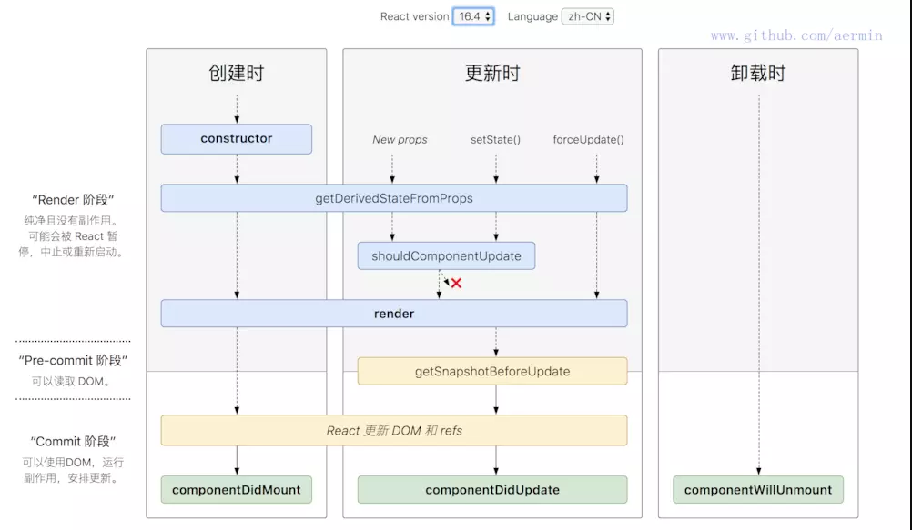

# React 学习笔记

### DOM的本质是什么？
浏览器中的概念，用js对象来表示页面上的元素，并提供了操作DOM对象的API。

### 什么是React中的虚拟DOM？
框架中的概念，是cxy用js对象来模拟页面上的DOM和DOM嵌套。

### 为什么要使用虚拟DOM？
是为了实现页面中，DOM元素的高效更新。

### DOM和虚拟DOM的区别？
表格数据从数据库中查询，存放在浏览器中的内存中，而且是以对象数组的形式表示的，表格每次数据发生变化都会重回整个页面。最优的方案就是，按需渲染，只重新渲染数据改变的页面元素。

### DOM树的概念？
1个网页呈现的过程（ps：无法获取浏览器中的DOM树，因为浏览器中没有直接提供获取DOM树的API）
1. 浏览器请求服务器获取页面HTML代码
2. 浏览器先在内存中，解析DOM 结构，并在浏览器内存中，渲染出一颗DOM树
3. 浏览器把DOM树，呈现到页面上

### 如何模拟一个DOM元素？
只能使用一个js对象来模拟DOM元素。

### 什么是库？什么是框架？
1. 小而巧的是库，优点是船小好调头，代码几乎不变。
2. 大而全的是框架，框架提供了一整套的解决方案。
3. 三大框架一大抄，ang最早开始组件化，vue国人开发最火，react最流行设计较为优秀。
4. ang印度用的比较多，vue国内用的比较多，react在欧美比较流行。
5. react出来较早，社区较为强大，解决方案较为比较好找

### 什么是模块化？什么是组件化？组件化的好处？
1. 模块化是从代码角度进行分析的，把一些可复用的代码抽离为单独的模块，抽离为单个的模块，便于项目的维护和开发。
2. 组件化是从UI界面角度进行分析的，把一些可复用的UI元素抽离为组件，也是便于项目的维护和开发。 
3. 随着项目的扩张，手里组件越来越多，创建页面可以直接拼接当前的组件。

### React 如何实现组件化的？
react中并没有vue中一样的模板文件，在react中一切都是以js来表现组件化的，所以对ES6和ES7有较高的要求。
 
### React 简介
1. 声明式的设计
2. 高效，采用虚拟DOM来实现DOM的渲染，最大限度减少DOM的操作
3. 灵活，可以和其他库灵活搭配使用
4. JSX，俗称js里面写HTML，JavaScript语法的拓展
5. 组件化，模块化，代码容易复用。2016年之前的大型项目非常喜欢用react
6. 单向数据流。没有实现数据的双向绑定。数据->视图->事件->数据

### React 安装
1. react安装不可以有大写字母
2. 安装react脚手架`npm install -g create-react-app`
3. 创建react项目`create-react-app react-hello`
4. 如果网站上有robots.txt的文件在爬虫界是一种君子协议，告知爬虫不要爬某些内容
5. react，专门用于创建组件和虚拟DOM的，同时组件的生命周期都在这个包中
6. react-dom，专门进行DOM操作的，最主要应用场景，就是`reactDOM.render()`

### React 创建虚拟DOM元素
+ 参数1：创建的元素的类型，字符串，表示元素的名称、
+ 参数2：是一个对象或者null，表示当前这个DOM元素的属性
+ 参数3：子节点（包括其他虚拟DOM获取的文本子节点）
+ 参数n：其他子节点
+ 官方不推荐创建虚拟DOM的方式  
```
	<h1 id='myh1' title='this is a h1'>这是一个大大的H1</h1>
	const myh1 = React.createElement('h1', null, '这是一个大大的h1')
	const myh1 = React.createElement('h1', { id: 'myh1', title:'this is a h1' }, '这是一个大大的h1')
	// 不建议这样使用嵌套，还是按照HTML写即可
	const mydiv = React.createElement('div', null, '这里是一个div元素', myh1)
```

### React 将虚拟DOM渲染到页面
+ 参数1：要渲染的虚拟DOM元素
+ 参数2：指定页面上一个DOM元素当作容器
+ `ReactDOM.render(myh1, document.getElementById('app'))`

### React JSX
1. 在JS文件中默认不可以写类似HTML的标记，否则会打包失败
2. 可以使用babel来转换JS中的HTML标签，他会自动转换成创建虚拟DOM的那种语法，实质上还是创建了虚拟DOM
3. 混合写入类似于HMTL的语法，叫做JSX语法，是符合XML规范的JS

### React 如何启用JSX
1. 安装bebel插件
+ `npm install babel-core babel-loader babel-plugin-transform-runtime -D`
+ `npm install babel-preset-env babel-preset-stage-0 -D`
2. 安装能够识别转换JSX语法的包
+ `npm install babel-preset-react -D`
3. 添加 ***.babelrc*** 配置文件
```
	{
		'preset': ['env', 'stage-0', 'react'],
		'plugins': ['transform-runtime']
	}
```
4. 添加 ***.babel-loader*** 配置项，参考 ***webpack.md*** 中 ***webpack配置第三方loader*** 的代码
5. 这些好像都是从零开始使用React所需要装载的一些依赖，如果是`create-react-app`方式安装貌似不需要走这些依赖配置步骤

### React JSX中混合写入JS表达式
1. 在JSX语法中，要将JS代码写到花括号{}中
2. 应用场景
+ 渲染数字
+ 渲染字符串
+ 渲染布尔值
+ 为属性绑定值
+ 渲染JSX元素
+ 渲染JSX元素数组
+ 将普通字符串数组，转为JSX数组并渲染到页面上[两种方案]
```
	// 方案一，先循环组装
	const strArr = ['a', 'b', 'c', 'd']
	const nameArr = [];
	strArr.forEach(item => {
		cosnt temp = <h5 key={item}>{item}</h5>
		nameArr.push(temp)
	})
	ReactDOM.render(
		<div>
			{nameArr}
		</div>, document.getElementById('app')
	)
	
	// 方案二，在jsx中循环渲染
	const strArr = ['a', 'b', 'c', 'd']
	{
		strArr.map(item => {
			return <h3 key={item}>{item}</h3>
		})
	}
```

### React 循环和Key
在React中，需要把Key添加给循环直接控制的元素，注意必须是最外层被循环的元素

### React JSX优缺点和表达式
优点
1. JSX执行更快，编译为JavaScript代码时进行优化
2. 类型更安全，编译过程中如果出错就不能编译，及时发现错误
3. JSX编写模板更加简单快速（但是不要和Vue比，确实截止目前为止我觉得Vue要方便太多了）

缺点
1. JSX必须要有根节点（这点和Vue的组件是一样的）
2. 正常的普通HTML元素要小写。如果是大写，会默认认为是组件

表达式
1. 由HTML元素构成
2. 中间如果需要插入变量用{}
3. {}中间可以使用表达式
4. {}中间表达式中可以使用JSX对象
5. 属性和HTML内容一样都是用{}来插入内容

### React 注释和样式
1. 不可以直接在JSX中用行内样式，必须用对象属性的方式才可以添加行内样式，而且对象属性必须用驼峰输入法或者用引号引起来方式，否则会直接报错
```
	let exampleStyle = {
		borderBottom: '1px solid red',
		'background-color': 'red'
	}
```
2. 多个内容class，不是使用数组，而是使用字符串空格字符串的方式 `class='class1 class2'`
3. 注释的方式是在花括号中用斜杠星 `{ /* 这里写注释 */ }`
4. class和style当中，不可以存在多个class属性，就是不可以写两个calss属性在一个元素中，属性值可以写多个class，参考2（PS：插入一个小知识点，数组合并的方法，`join()`）
5. 为jsx中的元素添加class类名需要使用`className`来替代`class`，不过现在新版本好像已经修复这个问题了
6. 在jsx中label标签的`for`属性需要使用`htmlFor`来代替

### React 组件
1. 函数式组件，一般用于静态没有交互事件内容的页面
2. 类组件，又称动态组件，一般用于有交互或者数据修改的操作。组件传参，通过this.props
3. 复合组件，组件中又有其他组件就叫复合组件，既可以有函数组件又可以有类组件

<!-- 20210129看了十分钟React看到这里非常抱歉，周一从这里继续学习 -->
### React 创建组件的方式
1. 第一种方式，函数式组件
```
	function Hello(){
		// 如果在一个组件中return一个null
		return null
	}
	
	ReactDom.render(
		<div>
			{/* 直接把组件的名称，以标签的形式，丢到页面上即可 */}
			<Hello></Hello>
		</div>,
		document getElementById('app')
	)
```

### React State
1. 相当于Vue中的data函数
2. 修改状态使用setState，如果要查看setState实时修改的数据需要调用回调函数，因为这是一个异步操作
3. 改变this指向，`this.zidingyiEvent = this.zidingyiEvent.bind(this)`
4. data-index 作为key值来区分不同组件？这个疑问待确认。然后设置完后的值可以在`zidingyiEvent`中通过`e`传参拿到`e.target.datset.index`;

### React props
1. 父组件传递给子组件数据，单项流动，不能传递给父组件
2. 传值的类型是任意的，没有限制
3. 可以设置默认值，同Vue
4. 可以传递函数，通过传递父组件的函数，通过修改父组件的state，从而达到传递数据给父组件的需求

### 如何设置B站的播放速度
document.querySelector('video').playbackRate = 3  
目前测试的结果是 0.07 - 16 的范围内任意数字

### React 父传子数据传递
```
// 父组件
class ParentCom extends React.Component{
	constructor(props){
		super(props)
		this.state = {
			isActive: true
		}
		// 改变this指向
		this.changeShow = this.changeShow.bind(this);
	}
	render(){
		<div>
			<button onClick={changeShow}>控制子元素显示</button>
			<ChildCom isActive={this.state.isActive} />
		</div>
	}
	changeShow(){
		this.setState({
			isActive: !this.state.isActive
		})
	}
}

// 子组件
class ChildCom extends React.Component{
	constructor(props){
		super(props)
	}
	render(){
		let strClass = null;
		strClass = this.props.isActive?'active':'';
		
		return {
			<div class={'content' + strClass}>
				<h1>我是子元素</h1>
			</div>
		}
	}
}

// 渲染组件
ReactDom.render(
	<ParentCom />,
	document.querySelector('#root')
)
```

### React 生命周期
+ 生命周期的概念：每个组件的实例，从创建、到运行、直到销毁，在这个过程中会触发一些时间，这些事件就叫做组件的生命周期函数
+ React组件的生命周期主要分为三部分：
	+ 组件创建阶段：特点是一次加载只执行一次
		> static.defaultProps = {} // 设置默认参数  
		> this.state = {} // 设置默认状态  
		> componentWillMount // 挂载前  
		> render // 正在渲染，在内存中创建虚拟DOM  
		> componentDidMount // 挂载完成  
	+ 组件运行阶段：按需，根据props属性或state状态的改变，有选择性的执行0到多次
		> componentWillReceiveProps // 接受新参数，props改变会触发这个钩子函数  
		> shouldComponentUpdate // 判断组件是否需要更新，state改变会触发这个钩子函数，在这里如果只有判断为需要更新的才会继续执行钩子函数  
		> componentWillUpdate // 更新前  
		> render // 更新中  
		> componentDidUpdate // 更新完成  
	+ 组件销毁阶段：特点是一次加载只执行一次
		> componentWillUnmount // 销毁组件  

### React 生命周期流程图
<!--  -->
<!-- 注意在图片地址后面必须加一个空格否则图片会无法加载 -->


### React 生命周期新增钩子函数示例图
